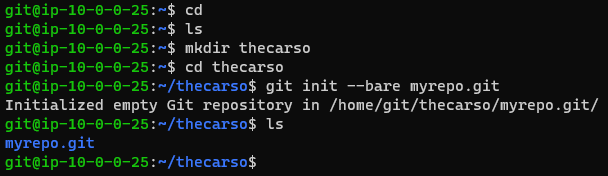
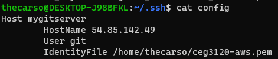
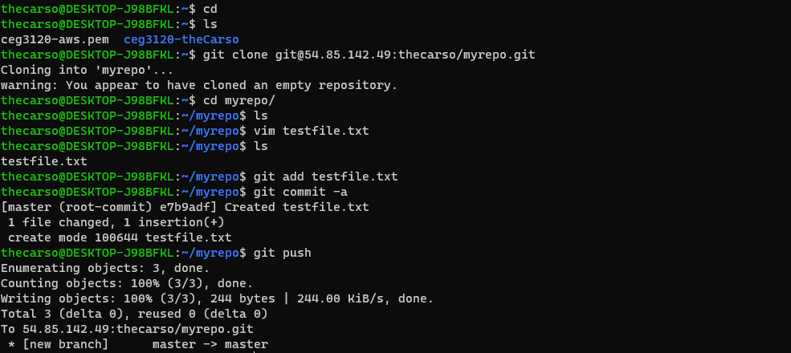

# Project 1

## Setup
1. `sudo adduser git`: Create the git user
    - Follow steps of creating password, information, etc
2. `cd ../git`: Enter the user's home directory
3. `sudo mkdir .ssh`: Create .ssh folder if not already created
4. `sudo vim .ssh/authorized_keys`: Copy public key into authorized_keys

## Initialize Repo
1. Connect to the AWS instance as the git user, with the corresponding private key from the last step.
    - `ssh -i ceg3120-aws.pem git@54.85.142.49`
2. `mkdir thecarso`: Create a folder for the user.
3. `cd thecarso`
4. `git init --bare myrepo.git`: Initialize a bare repo, without a workspace.  

## Configuring .ssh/config file on home system
1. `cd .ssh`
2. `vim config`:  
    
3. `chmod 600 config`: Set permissions

## Using the Repo
1. Cloning the repo (EITHER ONE): 
    - `git clone mygitserver:thecarso/myrepo.git`: Clones using the host setup in the prior steps.
    - `git clone -i ceg3120-aws.pem git@54.85.142.49:thecarso/myrepo.git`: Clones using a specified key
2. Modify/Create files.
3. `git add <filename>`: Add file to be tracked
4. `git commit -a`: Commit to the repo
5. `git push`: Push changes to the server.  

