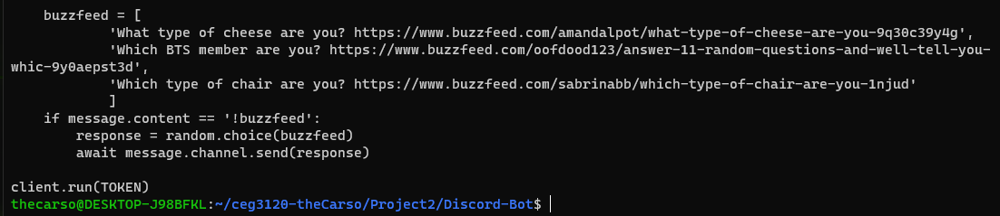

# Project 2

## Setup:
  1. `https://discord.com/developers/applications` Discord Developer Portal
  2. Create a New Application
  3. Create a Bot with that Application
  4. Install dotenv:
        - `sudo apt update` (May not be needed)
        - `sudo apt install python3-pip` (May not be needed)
        - `pip3 install -U python-dotenv`
  5. Install discord for python:
        - `pip3 install discord`
  6. Put the following in `.env` file 
        - Discord token: Under the Bot tab in the Developer settings.
        - Discord guild: Found in Server Settings > Widget > Server ID  
        
  7. Generate an OAuth link:
        - In the Developer Portal, OAuth2 tab.
        - Add an empty redirect URI (not ideal for any public use)
        - Select "bot" as the scope
        - Select the permissions the bot needs. For this example, Administrator was used.
        - Open the link in your browser and let the bot join your server.
  8. Run the bot:
        - `python3 bot.py`

## Modification:
  1. `git branch command`: Creates a branch
  2. `git checkout command`: Selects the branch
  3. Make changes:  
      
  4. `git add bot.py` and `git commit`: Add and commit the updated file
  5. `git push --set-upstream origin command`: Sets the branch upstream to command.
  6. `git checkout main`: Go back to the main branch (what I want to merge into).
  7. `git merge command`: Merges command into main.
  8. `git push`

## 24/7 Solutions:
      The best solution to keeping the bot running would be by running it in a screen. By running  
      in a screen, the bot could be run 24/7 and the machine could still be used either in another  
      screen or outside of the screen.
