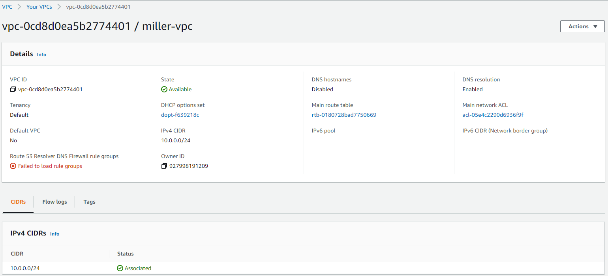
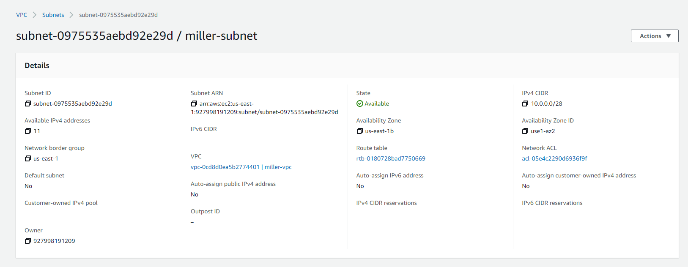
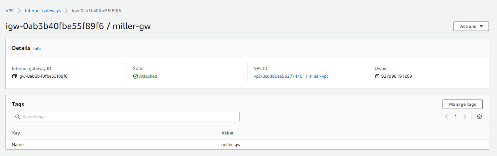
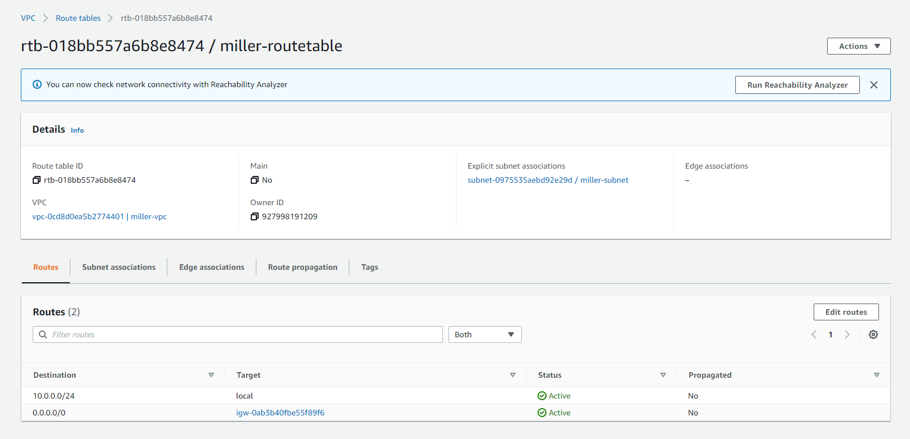
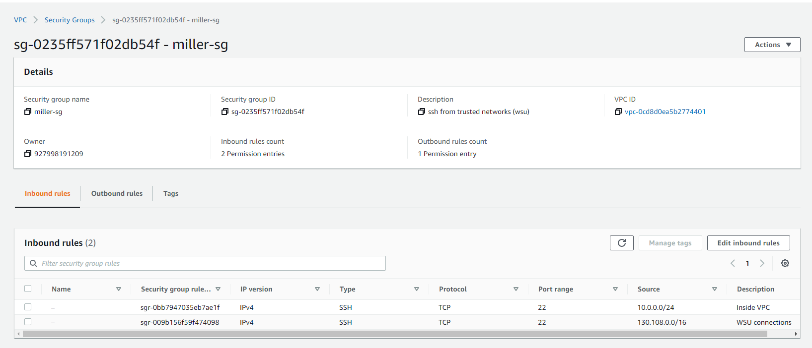
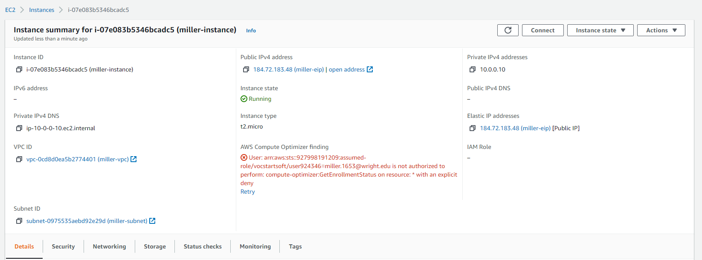
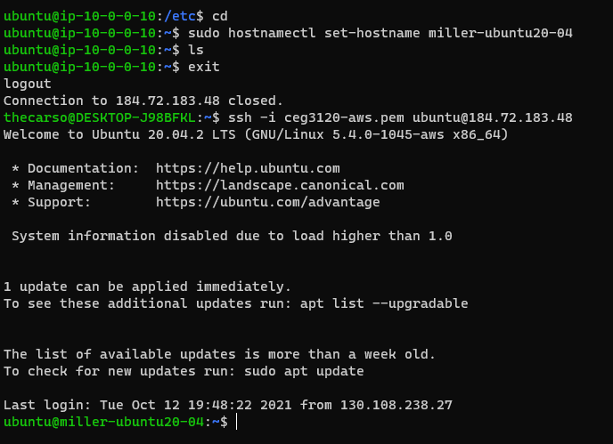

# PART 1:

VPC:
The VPC is a network configuration, containing all of the components below.

 
Subnet:
A subset of IP addresses in the VPC that are allowed to communicate directly with each other

Internet Gateway:
A gateway that takes in traffic and routes it to the open internet

Route Tables:
A table that determines where traffic from specified subnets should be routed to.

Security Group:
Specifies rules for what inbound and outbound traffic should be allowed. Can be used to filter protocols and port numbers.

# PART 2:

1. Ubuntu Server 20.04 LTS (HVM), SSD Volume Type
    * USER: ubuntu
    * INSTANCE TYPE: t2.micro 
2. Selected my VPC under "Network" in `Step 3: Configure Instance Details`
3. We are not auto-assigned an IP. This is because we want our own persistent IP that we are guaranteed.
4. Selected 8GB of General Purpose SSD under `Step 4: Add Storage` while launching the EC2.
5. Added a tag with the key "Name" in `Step 5: Add Tags` while launching.
6. Selected "Select an existing security group" and chose miller-sg in `Step 6: Configure Security Group`
7. Select Elastic IP on the left side, Allocate Elastic IP address, add a name and allocate.
    * Actions > Associate Elastic IP Address - then choose the instance to associate with
8. 
9. `ssh -i ceg3120-aws.pem ubuntu@184.72.183.48`
    * `sudo hostnamectl set-hostname miller-ubuntu20-04`
10. 