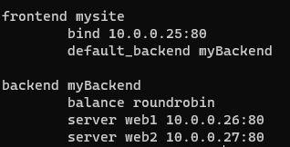
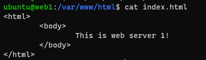

# Project 5

# Part 2

1. Added the following lines to the /etc/hosts, with the format of `{privateIP} {alias}`
```
10.0.0.25 proxy
10.0.0.26 web1
10.0.0.27 web2
```

2. `ssh -i <key> {hostname}` where hostname is proxy, web1, or web2.

3. HAProxy Configuration
    - Install Package: `sudo apt install haproxy`
    - Modifications: `/etc/haproxy/haproxy.cfg` was modified

    

    - To reload: `sudo systemctl reload haproxy.service`
    - Resource: `https://www.haproxy.com/blog/the-four-essential-sections-of-an-haproxy-configuration/`

4. Webserver Configurations
    - Install Package: `sudo apt install apache2`
    - Modifications: `/var/www/html/index.html` was modified
    
    

    - To reload: `sudo systemctl reload apache2.service`
    - Resource: `https://www.digitalocean.com/community/tutorials/how-to-install-the-apache-web-server-on-ubuntu-20-04`

5. Images of Browser:
    
    
    

